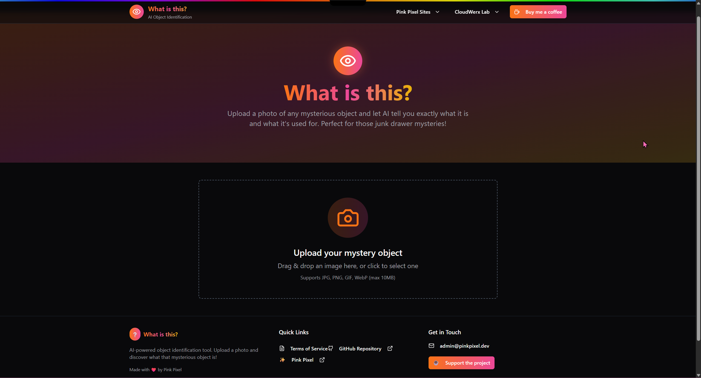
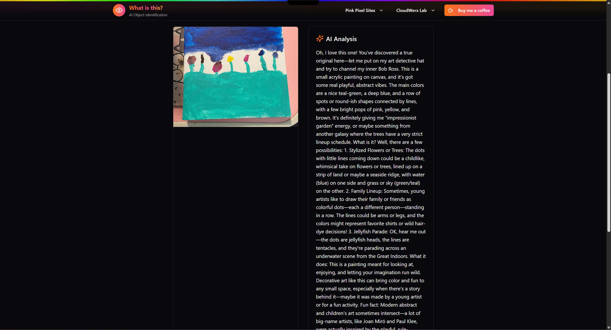

# ❔What is this?

> **Dream it, Pixel it** ✨

A fun and intuitive AI-powered object identification tool that helps you identify mysterious objects with just a photo upload!

## 🏷️ Badges

     

   

 

## 📸 Screenshots

### 🏠 Homepage - Upload Interface

*Clean, modern interface with drag & drop functionality for easy image uploads*

### 🤖 AI Analysis Results

*Detailed AI-powered analysis showing object identification and usage information*

## 🌟 What it does

Ever found a weird gadget in your junk drawer and wondered "What is this thing?" This web app uses advanced AI vision to analyze your photos and tell you exactly what that mysterious object is and what it's used for!

## 🚀 How to use

### 🌐 Visit the Website

Simply go to **[https://whatisthis.pinkpixel.dev](https://whatisthis.pinkpixel.dev)** and start identifying objects instantly!

### 📸 Upload & Discover

1. **Upload a photo** - Drag & drop or click to select an image
2. **Wait for AI magic** - Our AI analyzes your mysterious object
3. **Get detailed insights** - Learn what it is and how it's used!

## ✨ Features

- 🤖 **AI-Powered Analysis** - Advanced computer vision for accurate object identification
- 📱 **Mobile Friendly** - Works perfectly on all devices
- 🎨 **Beautiful UI** - Modern, gradient-based design with smooth animations
- ⚡ **Instant Results** - Fast AI processing for quick identification
- 🔒 **Privacy First** - No signup required, images processed securely

## 🛠️ Tech Stack

- **Frontend**: React 19 + TypeScript + Vite
- **Styling**: TailwindCSS + shadcn/ui components
- **AI**: Pollinations API for image analysis
- **Deployment**: Modern web hosting

## 🎯 Perfect for

- 🔍 Identifying unknown objects and gadgets
- 🏠 Organizing household items
- 🛠️ Understanding tool purposes
- 🎓 Educational exploration
- 🤔 Satisfying curiosity about mysterious items

## 🌈 About Pink Pixel

Made with ❤️ by [Pink Pixel](https://pinkpixel.dev) - where we turn dreams into digital reality!

### 🔗 Connect with us

- 🌐 **Website**: [pinkpixel.dev](https://pinkpixel.dev)
- 💼 **GitHub**: [github.com/pinkpixel-dev](https://github.com/pinkpixel-dev)
- 💬 **Discord**: @sizzlebop
- ☕ **Support**: [Buy me a coffee](https://www.buymeacoffee.com/pinkpixel)

## 📄 License

This is a web application service. See [Terms of Service](./TERMS_OF_SERVICE.md) for usage terms.

## 🤝 Contributing

Interested in contributing? Check out our [Contributing Guidelines](./CONTRIBUTING.md)!

---

**✨ Dream it, Pixel it** - Made with ❤️ by Pink Pixel
